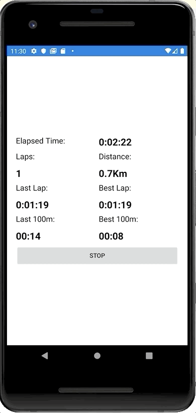
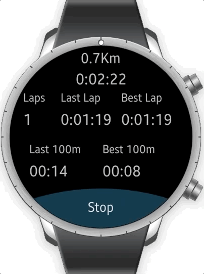
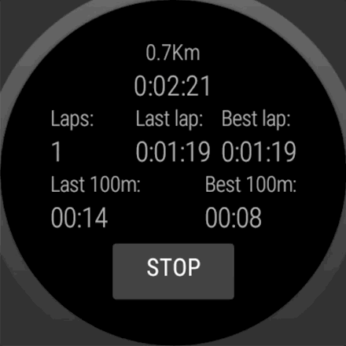

# SmartSkating
Speed skating activity tracker for long tracks (400m rinks)

**Code Quality**

**Tests coverage (Core)**

## Build status ##
**Core**

## Supported Platforms ##
**Android**

**Tizen wear**

**Wear OS**

