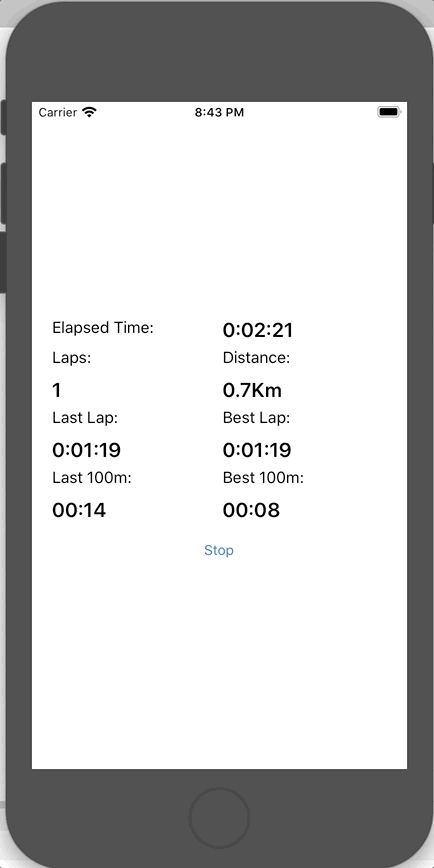

# SmartSkating
Speed skating activity tracker for long outdoor tracks (400m rinks). Both outdoor and indoor.

**Code Quality**

**Tests coverage (Core)**

## Build status ##

|Core   |Azure Functions   |Dashboard
|:-:|:-:|:-:|
|   |   |

## Supported Platforms ##

**Mobile**

|Android   |iOS   
|:-:|:-:|
|   |   

**Wearable**

|Tizen   |WearOs   
|:-:|:-:|
|   |

**Dashboard**

|Web (UNO Wasm)   |Mac   |UWP
|:-:|:-:|
|   |
|https://smartskating.azureedge.net/
